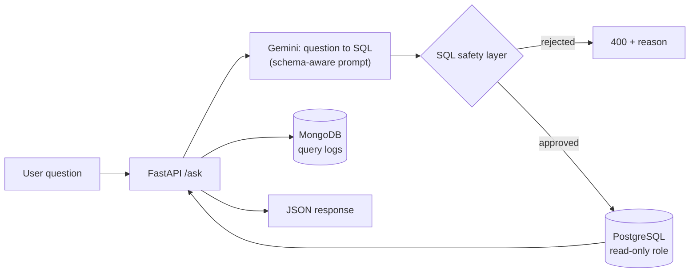

# 🧠 SQL Copilot

Ask questions about your data in plain language and get safe, read-only SQL plus the results back.
A Text-to-SQL service built with FastAPI, PostgreSQL, MongoDB and Google Gemini, with a defense-in-depth approach to LLM-generated SQL.


**Live Demo:** https://sql-copilot.onrender.com/docs
*(Free-tier hosting: the first request after a period of inactivity can take up to ~50 seconds.)*

---

## What it does

```bash
curl -X POST https://sql-copilot.onrender.com/ask \
  -H "Content-Type: application/json" \
  -d '{"question": "Kaç tane müşteri Two year sözleşmeye sahip?"}'
```
*(Turkish for: "How many customers have a Two year contract?”)*

```json
{
  "question": "Kaç tane müşteri Two year sözleşmeye sahip?",
  "generated_sql": "SELECT COUNT(*) FROM customers WHERE \"Contract\" = 'Two year' LIMIT 100",
  "results": [{"count": 1695}],
  "row_count": 1
}
```

## Architecture



- The table schema is read dynamically from `information_schema` and injected into the prompt, so the model only sees columns that actually exist.
- The LLM provider sits behind a single function (`generate_sql`). It was swapped for a different provider during development without touching the safety, database or logging layers.

## Security model

LLM output is treated as untrusted input. Two independent layers protect the database:

1. **Application layer** (`sql_safety.py`): only `SELECT` statements are accepted, forbidden keywords (`DROP`, `DELETE`, `UPDATE`, ...) and statement chaining (`;`) are rejected, and a `LIMIT` is enforced in code, not just requested in the prompt.
2. **Database layer**: the API connects with a dedicated PostgreSQL role that only has `SELECT`. Even if a malicious statement slipped past layer 1, the database would refuse to execute it.

Secrets live in `.env` (git-ignored) and CI runs with a mock LLM, so no API key is ever needed in the pipeline.

## Observability

Every successful `/ask` call is logged to MongoDB (question, generated SQL, row count, token usage, latency). Logging is fault-tolerant: a logging failure never breaks the API response.

## Tech stack

| Layer | Technology |
|---|---|
| API | Python 3.12, FastAPI, Pydantic |
| LLM | Google Gemini (via `google-genai`) |
| Analytics DB | PostgreSQL (SQLAlchemy) |
| Log store | MongoDB (PyMongo) |
| Containerization | Docker |
| CI | GitHub Actions (Postgres + MongoDB service containers) |
| Hosting | Render (API), Neon (PostgreSQL), MongoDB Atlas (logs) |

**Why two databases?** Structured, queryable analytics data lives in PostgreSQL; schema-flexible, append-only log records live in MongoDB.

## Data

Telco Customer Churn sample dataset (IBM sample data, distributed via Kaggle), 7,043 rows, loaded into a single `customers` table.

## Local setup

```bash
git clone https://github.com/zeysukg36/sql-copilot.git
cd sql-copilot
cp .env.example .env            # then fill in the values, incl. GEMINI_API_KEY

docker compose up -d postgres mongo

python -m venv venv && source venv/bin/activate
pip install -r db/requirements.txt
(cd db && python load_data.py)
```

Create the read-only role once (use the same password as in `READONLY_DATABASE_URL`):

```sql
CREATE ROLE readonly_copilot WITH LOGIN PASSWORD '<password>';
GRANT CONNECT ON DATABASE churn_analytics TO readonly_copilot;
GRANT USAGE ON SCHEMA public TO readonly_copilot;
GRANT SELECT ON ALL TABLES IN SCHEMA public TO readonly_copilot;
```

```bash
pip install -r api/requirements.txt
cd api && uvicorn main:app --port 8002
```

Swagger UI: http://localhost:8002/docs

## API

| Method | Endpoint | Description |
|---|---|---|
| `POST` | `/ask` | Natural-language question → validated SQL → results |
| `GET` | `/health` | Service and database connectivity check |

## Testing

```bash
cd api
MOCK_LLM=true pytest -v
```

`MOCK_LLM=true` replaces only the LLM call; the safety layer, the read-only PostgreSQL connection and the logging pipeline still run for real. The CI workflow provisions PostgreSQL and MongoDB service containers and runs the same suite on every push.

## Deployment and persistence

| Component | Service | Note |
|---|---|---|
| API | Render Web Service (Docker, free) | Cold start after ~15 min idle |
| PostgreSQL | Neon (free) | Permanent free tier; compute suspends when idle |
| Query logs | MongoDB Atlas (M0) | |

PostgreSQL is hosted on Neon rather than Render because Render's free PostgreSQL databases expire after 30 days.

## Known limitations

- Free-tier cold starts: Render (~50 s) and Neon's compute resume add latency to the first request.
- The Gemini free tier has a daily request quota; when it is exhausted `/ask` returns `503`.
- The keyword filter uses substring matching and can over-reject harmless queries (e.g. a column name containing `CREATE`). The read-only database role is the authoritative guarantee.
- Single-table schema; the public demo has no authentication or rate limiting.

## Roadmap

- [ ] `/stats` endpoint: usage, latency and token-cost summary from the query logs
- [ ] Per-IP rate limiting for the public endpoint
- [ ] Multi-table schemas and query explanations

## 👩‍💻 Author

**Zeynep Karagöz**
Management Information Systems (MIS) Student

- LinkedIn: [linkedin.com/in/zeynepkaragozz](https://www.linkedin.com/in/zeynepkaragozz)
- Email: [zeynepkaragoz3637@gmail.com](mailto:zeynepkaragoz3637@gmail.com)
- GitHub: [github.com/zeysukg36](https://github.com/zeysukg36)
